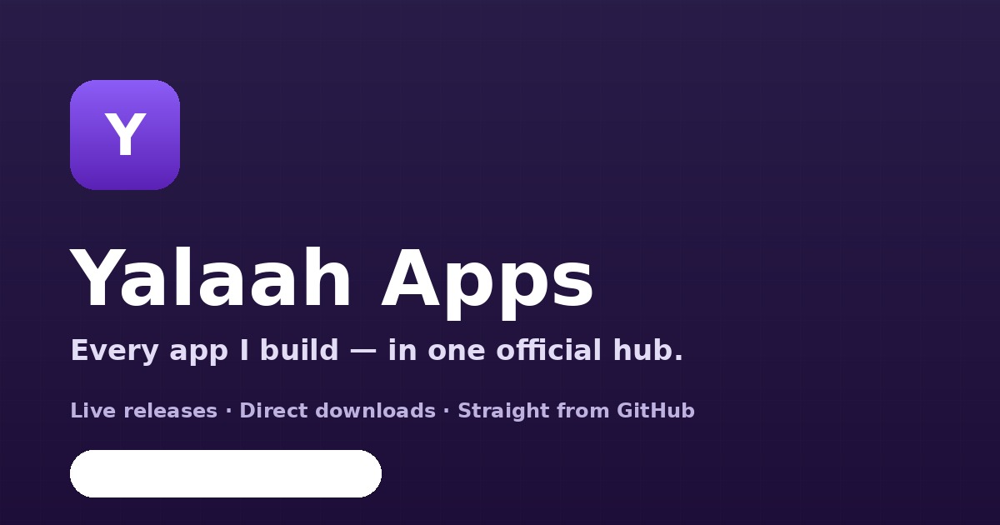

# Yalaah Apps — Personal App Distribution Hub



**The official hub for every app and project published on GitHub** — live release information, real release notes, and direct download links, all in one fast, static website.

**Live URL (after deployment):** https://yalaahamdy.github.io

---

## What is this?

Instead of visiting each repository on GitHub separately, this site collects every project in one professional distribution platform. Visitors can:

- Browse all apps with **search, category filters, platform filters and sorting**
- See the **latest version of every app**, read live from the GitHub API
- Read the **real release notes** of the newest release
- **Download the latest build directly** — buttons point at the official GitHub Release assets (APK, EXE, ZIP, DEB, DMG, …), never at re-uploads
- Follow a combined **Latest Updates** feed across all projects, sorted by publish date

The site itself is a **fully static export** built with Next.js 16 (App Router) + TypeScript + Tailwind CSS 4. There is no backend, no database and no paid service — it runs on GitHub Pages forever.

## How it works

```
data/apps.json  (the only place you edit)
        │
        ▼  build time (GitHub Actions)
Static HTML for  / ,  /apps/ ,  /apps/<slug>/  and  /updates/
        │
        ▼  runtime (visitor's browser)
GitHub REST API  ──►  latest release, notes, assets, download links
        │               (cached in localStorage + ETag revalidation,
        │                one request per app, concurrency-limited)
        ▼
Live "Latest Version" · "What's New" · Download buttons
```

Key properties:

- **Single source of truth** — `data/apps.json` lists the apps; everything else (versions, dates, notes, assets) comes live from GitHub at view time.
- **Rate-limit friendly** — the app probes the free `/rate_limit` endpoint first; if the remaining quota can't cover one request per app it degrades to cached data instead of hammering the API. Conditional requests (ETag / `If-None-Match`) return `304` responses that **don't count against the limit**, so repeat visits are nearly free.
- **Never invents data** — if GitHub can't answer, the UI says so ("Release info unavailable", "No public release available yet", "Source release available") instead of showing fake versions or dead download buttons.
- **Safe rendering** — release notes (markdown) are rendered by a purpose-built React renderer that never uses `dangerouslySetInnerHTML`, so untrusted content can't inject markup.
- **No secrets** — the frontend only talks to the public GitHub API. There are no tokens, keys or secrets anywhere in the code.

## Bilingual by design — عربي / English

The site is **Arabic-first**: it prerenders in Arabic (RTL) and every string lives in two full dictionaries (`src/i18n/ar.ts`, `src/i18n/en.ts`). A compact toggle in the header switches instantly, the choice persists in `localStorage`, and first-time visitors get their browser language automatically (a no-flash script applies `lang`/`dir` before first paint).

- **Typography** — self-hosted **IBM Plex Sans Arabic** (a technical typeface carrying both Arabic and Latin) + **IBM Plex Mono** for versions, sizes and code. No font CDN, no layout shift.
- **True RTL** — logical CSS properties everywhere, arrows and breadcrumbs mirror themselves, letter-spacing is disabled for connected Arabic script, and versions/asset names stay LTR islands inside RTL copy.
- **Locale-aware formatting** — relative times (“قبل ٧ أيام” / “أول أمس” / “2 hours ago”) and dates via `Intl`, with Latin digits for a technical look.
- **Content** — every app entry may carry a curated `descriptionAr`; the search also indexes the Arabic text.

## Real app icons — straight from the repositories

Every app shows its **actual icon**, resolved through a three-step chain (`src/lib/services/icons.ts`):

1. **Configured icon** — `"icon": "/app-icons/clipvault.webp"` (a site asset), an absolute URL, or a path *inside the repository* rendered live from `raw.githubusercontent.com`.
2. **Automatic discovery** — when no icon is configured, the app queries the repo's git tree once (cached 24h) and picks the best match: root `icon.png`/`logo.svg`, Android `mipmap-*` launcher icons, Tauri/Electron icons, …
3. **Deterministic letter-mark** — a stable gradient monogram derived from the app name; never a random web image.

The icons shipped in `public/app-icons/` are **optimized WebP/SVG copies of the real repository icons** (≤512px, ~190 KB total instead of 4.5 MB of raw PNGs), including faithful SVG reconstructions of SafeGuard's and SecureBrowser's Android adaptive icons (built from the apps' own vector XML). When an icon changes upstream, refresh the copies:

```bash
python3 scripts/sync_app_icons.py   # provenance report → research/icon-map.json
```

## Adding a new app (the only workflow you'll ever need)

1. Open [`data/apps.json`](data/apps.json).
2. Add an entry to the `apps` array:

```json
{
  "slug": "my-new-app",
  "name": "My New App",
  "repository": "yalaahamdy/MyNewApp",
  "description": "One clear sentence describing what the app does.",
  "descriptionAr": "جملة واحدة واضحة تصف ما يفعله التطبيق.",
  "platforms": ["Android"],
  "category": "Utilities",
  "featured": false
}
```

3. Optional: run `python3 scripts/sync_app_icons.py` to pull the app's real icon into `public/app-icons/` and add `"icon": "/app-icons/my-new-app.webp"` (skipping this is fine — the site auto-discovers the icon in the repo at runtime).
4. Commit and push to `main`. GitHub Actions builds and deploys automatically.

That's it. The site generates a dedicated page at `/apps/my-new-app/`, adds it to search/filters/sitemap, and starts showing its live releases. Publishing **v2.0.0** in that repo later updates the site with zero code changes.

### Optional fields

| Field | Purpose |
|---|---|
| `icon` | Icon source: `"/path"` site asset (recommended), absolute URL, or a repo file path rendered live. Without it the icon is **auto-discovered in the repository**; final fallback is a stable gradient letter-mark (no random web images). |
| `descriptionAr` | Arabic description shown when the site language is العربية (used in cards, detail page and SEO). |
| `featured: true` | Shows the app in the "Featured" section on the home page. |
| `platforms` | Shown as chips; download grouping still comes from the actual release assets. |
| `screenshots` | `[{ "src": "...", "alt": "..." }]` — rendered in a gallery on the app page. |
| `assetOverrides` | Force classification when auto-detection can't: `{ "match": "\\\\.zip$", "platform": "Windows", "label": "Portable ZIP" }` |

### Asset & platform detection

Release assets are classified by file name (`.apk`, `.exe`, `.msi`, `.dmg`, `.pkg`, `.deb`, `.rpm`, `.AppImage`, `.snap`, `.zip`, `.tar.gz`, browser extensions…), with filename keywords (`win`, `android`, `mac`, `linux`, `portable`) used for ambiguous archives. Checksum files (`*.sha256`, `checksums.txt`, …) are separated into a verification section, never shown as fake download buttons. Anything unclassifiable lands in "Other" — and `assetOverrides` in `data/apps.json` always wins.

## States that never break

| Situation | What visitors see |
|---|---|
| App has a release with assets | Platform-grouped download buttons with file size + download counts |
| Release without assets | "Source release available" + link to the release (no fake buttons) |
| Repo with zero releases | "No public release available yet." + link to the repo |
| Repo missing / private | "Repository unavailable" panel |
| GitHub API down or rate-limited | Clear error panel with **Try again**; cached data shown with a "cached" marker when available |
| Config lists a repo you never published | It simply appears with its honest state — nothing crashes |

## Development

Prerequisites: **Node.js 20+** (or Bun) and npm.

```bash
npm install        # install dependencies
npm run dev        # dev server on http://localhost:3000
npm run lint       # ESLint
npm run typecheck  # tsc --noEmit
npm test           # vitest unit tests (asset detection, markdown safety, cache, formatting)
npm run build      # static export → ./out
npm run preview    # serve ./out locally (npx serve out)
```

The build runs `next build` with `output: "export"` — the result in `out/` is plain HTML/CSS/JS ready for any static host.

## Deployment (GitHub Pages)

1. Push this project to the `yalaahamdy/yalaahamdy` repository, branch `main`.
2. The included workflow (`.github/workflows/deploy.yml`) runs on every push:
   `npm ci → lint → typecheck → tests → build → deploy to GitHub Pages`.
   Deployment only happens if lint, types and tests all pass.
3. First time only: **Settings → Pages → Source → GitHub Actions**. (The workflow calls `actions/configure-pages` with `enablement: true`, which normally handles this automatically.)

### Custom domain

1. Add a `CNAME` file (containing your domain, e.g. `apps.example.com`) to `public/`.
2. Point your DNS at GitHub Pages (`A`/`AAAA`/`CNAME` records per GitHub docs).
3. Update `site.url` in `data/apps.json` to `https://apps.example.com` and rebuild — canonical URLs, sitemap, OG tags and JSON-LD all derive from it.

### Deploying from a *project* site (`/repo-name/` path)

Set the base path before building:

```bash
NEXT_PUBLIC_BASE_PATH=/repo-name npm run build
```

`NEXT_PUBLIC_BASE_PATH` is read by `next.config.ts`; the app code (`withBasePath`) and links use Next's basePath automatically.

## Configuration reference

Everything user-editable lives in two files:

- `data/apps.json` — site identity (`site`) + the app registry (`apps`). See [`data/apps.schema.json`](data/apps.schema.json) for the full schema with editor autocompletion (`"$schema"` is already wired).
- `src/lib/config.ts` — API endpoint, cache TTL — rarely needs touching.

## Project structure

```
├── data/
│   ├── apps.json              ← the app registry (edit me)
│   └── apps.schema.json       ← JSON Schema for the registry
├── src/
│   ├── app/                   ← routes: /, /apps/, /apps/[slug]/, /updates/, 404
│   │   ├── layout.tsx         ← shell, metadata, theme + i18n providers
│   │   ├── manifest.ts        ← PWA manifest
│   │   ├── sitemap.ts         ← sitemap.xml (includes every app page)
│   │   └── robots.ts
│   ├── i18n/                  ← ar/en dictionaries, provider, labels, parity tests
│   ├── components/
│   │   ├── apps/              ← cards, explorer, detail, downloads, feeds
│   │   ├── site/              ← header, footer, theme + language toggles, SW
│   │   ├── states/            ← error/empty panels
│   │   └── ui/                ← button, badge, input, skeleton primitives
│   ├── lib/
│   │   ├── config.ts          ← site config + types
│   │   ├── apps.ts            ← registry helpers
│   │   ├── markdown.tsx       ← XSS-safe markdown renderer
│   │   ├── services/
│   │   │   ├── github.ts      ← the ONLY file that calls the GitHub API
│   │   │   ├── releases.ts    ← budget-aware loading orchestration
│   │   │   ├── icons.ts       ← icon resolution: config → repo discovery → mark
│   │   │   └── cache.ts       ← localStorage cache (ETag + TTL + pruning)
│   │   └── utils/             ← asset detection, locale-aware formatting
│   └── app/globals.css        ← design tokens (light/dark) + RTL-aware styles
├── public/
│   ├── app-icons/             ← optimized copies of the real repo icons
│   └── favicon, PWA icons, og-image, sw.js
├── scripts/
│   └── sync_app_icons.py      ← refresh app icons from their repositories
├── .github/workflows/deploy.yml
└── next.config.ts             ← static export + base path
```

## Performance & privacy notes

- Zero UI framework beyond React (no state libraries); a single small JS bundle shared by all pages, aggressively cached by the browser and the service worker.
- Self-hosted IBM Plex Sans Arabic + IBM Plex Mono (subset WOFF2) — no font CDN, zero layout shift, ~60 KB per language script.
- The service worker is intentionally minimal: network-first for pages (release data is never served stale), cache-first only for content-hashed static assets, and it **never** intercepts `api.github.com`.
- No cookies, no analytics, no trackers — the only external call is the public GitHub API.

## Arabic quick start — البدء السريع

- **تشغيل محلي:** `npm install` ثم `npm run dev` وافتح `http://localhost:3000`.
- **اللغتان:** الموقع عربي أولًا (RTL) مع تبديل فوري إلى الإنجليزية من الهيدر؛ كل النصوص في `src/i18n/ar.ts` و`en.ts`، واختبارات «تكافؤ القواميس» تضمن اكتمال الترجمة دائمًا.
- **أيقونات التطبيقات:** تُعرض الأيقونات الحقيقية من المستودعات. لتحديثها بعد تغيير أيقونة في مستودعك: `python3 scripts/sync_app_icons.py` ثم ارفع التغييرات (وإن لم تُحدّثها فسيكتشفها الموقع تلقائيًا من المستودع).
- **إضافة تطبيق جديد:** أضف عنصرًا واحدًا إلى `data/apps.json` (الاسم، `owner/repo`، وصف + `descriptionAr`، منصات، تصنيف) ثم ارفع التغييرات إلى `main` — سيبني GitHub Actions الموقع وينشره تلقائيًا، وستُكتشف الإصدارات الجديدة من GitHub Releases تلقائيًا دون أي تعديل آخر.
- **النشر:** المستودع مستعد لـ GitHub Pages؛ عند أول دفع، فعّل **Settings → Pages → Source → GitHub Actions** إن لم يُفعّلها الـ workflow تلقائيًا.
- **نطاق مخصص:** ضع ملف `CNAME` في `public/`، حدّث `site.url` في `data/apps.json`، ثم ارفع التغييرات.
